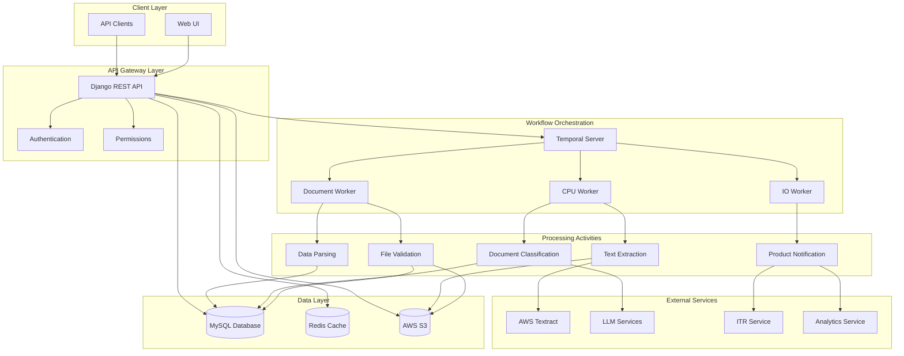
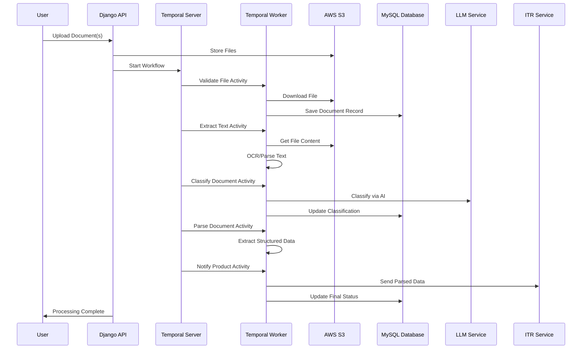
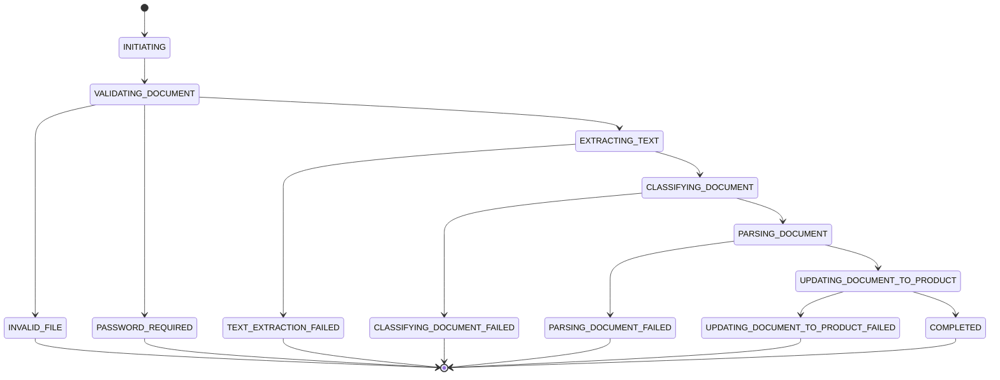
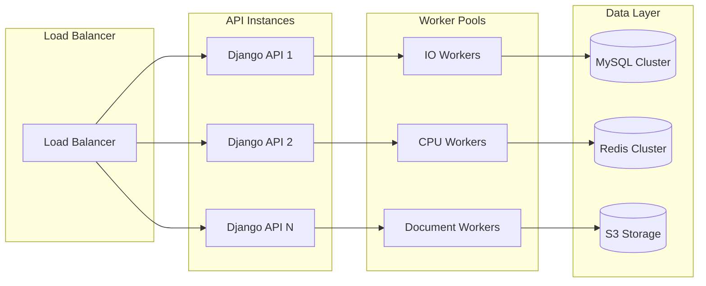

# Document Processing Service - Architecture Documentation

## Executive Summary

The Document Processing Service is a microservices-based platform designed for high-volume tax document processing during ITR (Income Tax Return) filing season. It leverages Temporal workflow orchestration to handle complex document processing pipelines with sub-minute processing times, supporting thousands of documents per hour.

## System Overview

**Primary Purpose**: Tax document processing service for ITR filing and related financial documents

**Key Users**: 
- End users (taxpayers)
- CAs (Chartered Accountants) 
- Relationship managers
- DIY users with different permission levels

**Performance Requirements**:
- High-volume processing: thousands of documents per hour during tax season
- Sub-minute processing times
- Real-time status tracking and updates

## Architecture Components

### 1. API Layer (Django REST Framework)
- **File Upload API** (`/upload/`): Handles multi-file uploads with metadata
- **Workflow Status API** (`/status/`): Real-time processing status tracking
- **Document Management APIs**: CRUD operations for documents
- **Configuration APIs**: Document type configuration management

### 2. Workflow Orchestration (Temporal)
- **Document Processing Workflow**: Main orchestration workflow
- **Activity-based Processing**: Modular activities for each processing step
- **Fault Tolerance**: Built-in retry mechanisms and error handling
- **Scalability**: Distributed worker architecture

### 3. Core Processing Activities
- **File Validation**: Size, format, password validation
- **Text Extraction**: OCR and text parsing from various formats
- **Document Classification**: Regex and LLM-based classification
- **Data Parsing**: Structured data extraction
- **Product Integration**: Integration with downstream services

### 4. Data Layer
- **MySQL Database**: Document metadata, configurations, user data
- **Redis Cache**: Session management, temporary data, presigned URLs
- **AWS S3**: Document storage and retrieval

### 5. External Integrations
- **AWS Textract**: OCR and text extraction services
- **LLM Services**: Document classification and parsing
- **Authentication Service**: User authentication and authorization
- **Analytics Service**: Processing metrics and monitoring
- **ITR Service**: Tax-specific document processing

### 6. Infrastructure Components
- **Docker Containerization**: Microservices deployment
- **Prometheus Metrics**: Performance monitoring
- **Sentry**: Error tracking and monitoring
- **Load Balancing**: High availability and scalability

## System Architecture Diagram



## Document Processing Flow



## Detailed Component Architecture

### API Layer Details

#### Core Endpoints
- `POST /upload/` - Multi-file upload with metadata
- `GET /status/` - Workflow status tracking
- `GET /status/document/{id}/` - Individual document status
- `DELETE /document/{id}/` - Document deletion
- `GET/POST/PUT/DELETE /document_type_configuration/` - Configuration management

#### Authentication & Authorization
- **SessionIDAuthentication**: Custom session-based authentication
- **CustomAuthorizationPermission**: Role-based access control
- **MultipleScopePermissionCheck**: Multi-level permission validation

### Temporal Workflow Architecture

#### Main Workflow: DocumentProcessingWorkflow
```python
# Workflow Steps:
1. INITIATING
2. VALIDATING_DOCUMENT
3. EXTRACTING_TEXT
4. CLASSIFYING_DOCUMENT
5. PARSING_DOCUMENT
6. UPDATING_DOCUMENT_TO_PRODUCT
7. COMPLETED
```

#### Activity Distribution
- **document-io-activity-queue**: File validation, document updates
- **document-cpu-activity-queue**: Text extraction, classification
- **parsing-worker-task-queue**: Document parsing
- **notify-worker-task-queue**: Product notifications

#### Error Handling
- **Retry Policies**: Configurable retry mechanisms
- **Non-retryable Errors**: Password issues, invalid files
- **Failure Notification**: Automatic error reporting
- **Analytics Integration**: Error tracking and metrics

### Data Architecture

#### Database Schema

##### Document Table
```sql
CREATE TABLE document (
    document_id INT AUTO_INCREMENT PRIMARY KEY,
    user_id UUID,
    workflow_id VARCHAR(200),
    product VARCHAR(100),
    scope VARCHAR(100),
    section VARCHAR(100),
    document_type_configuration_id INT,
    llm_classified BOOLEAN DEFAULT FALSE,
    llm_parsed BOOLEAN DEFAULT FALSE,
    status VARCHAR(50) DEFAULT 'PENDING',
    s3_url VARCHAR(500),
    document_name VARCHAR(500),
    password VARCHAR(255),
    ocr_extracted BOOLEAN DEFAULT FALSE,
    extracted_data LONGBLOB,
    product_document_external_id VARCHAR(200),
    deleted BOOLEAN DEFAULT FALSE,
    uploaded_at TIMESTAMP DEFAULT CURRENT_TIMESTAMP,
    updated_at TIMESTAMP DEFAULT CURRENT_TIMESTAMP ON UPDATE CURRENT_TIMESTAMP
);
```

##### DocumentTypeConfiguration Table
```sql
CREATE TABLE document_type_configuration (
    id INT AUTO_INCREMENT PRIMARY KEY,
    document_category VARCHAR(128),
    document_subcategory VARCHAR(128),
    product VARCHAR(100),
    regex_patterns JSON,
    parser_activity VARCHAR(64),
    notify_activity VARCHAR(64),
    redirection_url VARCHAR(500),
    allowed_extensions JSON,
    created_at TIMESTAMP DEFAULT CURRENT_TIMESTAMP,
    updated_at TIMESTAMP DEFAULT CURRENT_TIMESTAMP ON UPDATE CURRENT_TIMESTAMP,
    UNIQUE KEY unique_doc_config (document_category, document_subcategory, product)
);
```

#### Document States Flow


### Security Architecture

#### Authentication & Authorization
- **Session Management**: Redis-based session storage
- **Role-based Access**: DIY_USER, ASSISTED_USER, CA, RELATIONSHIP_MANAGER
- **Permission Scopes**: Read/Write permissions per user type
- **Workspace Isolation**: Multi-tenant data separation

#### Data Security
- **Payload Encryption**: Temporal workflow data encryption using AES
- **S3 Security**: Presigned URLs with 180-second expiration
- **Password Protection**: Document password validation and auto-generation
- **Data Encryption**: Binary data compression and encryption in database

#### Compliance & Privacy
- **Data Retention**: Configurable document retention policies
- **Audit Logging**: Comprehensive activity logging
- **PII Protection**: Secure handling of personal tax information
- **Access Controls**: Fine-grained permission management

### Performance & Scalability

#### Horizontal Scaling Strategy


#### Performance Optimizations
- **Connection Pooling**: Database connection optimization
- **Async Processing**: Non-blocking I/O operations
- **Caching Strategy**: Multi-level caching (Redis, application-level)
- **Batch Processing**: Bulk document processing capabilities
- **Resource Isolation**: Separate queues for different workload types

#### Metrics & Monitoring
- **Custom Metrics**: Processing latency, throughput, error rates
- **Temporal Metrics**: Workflow execution statistics
- **Business Metrics**: Document types processed, user activity
- **Infrastructure Metrics**: CPU, memory, disk usage

### External Service Integration

#### AWS Services
- **S3**: Document storage with lifecycle policies
- **Textract**: OCR and document analysis
- **IAM**: Access management for AWS resources

#### Third-party Services
- **LLM Services**: OpenAI/custom models for classification
- **Authentication Service**: External user management
- **ITR Service**: Tax-specific processing logic
- **Analytics Service**: Business intelligence and reporting

#### Integration Patterns
- **Circuit Breaker**: Fault tolerance for external calls
- **Retry Logic**: Exponential backoff for transient failures
- **Timeout Management**: Configurable timeouts per service
- **Health Checks**: Service availability monitoring

### Deployment Architecture

#### Container Strategy
```yaml
# docker-compose.yml structure
services:
  mysql:           # Database
  temporal:        # Workflow engine
  temporal-ui:     # Workflow monitoring
  document-processing:  # Main API
  temporal-worker:      # Background workers
```

#### Environment Configuration
- **Development**: Local Docker setup with hot reload
- **Staging**: Production-like environment for testing
- **Production**: High-availability multi-instance deployment

#### Infrastructure as Code
- **Docker Compose**: Local development environment
- **Kubernetes**: Production orchestration (implied)
- **Environment Variables**: Centralized configuration
- **Secret Management**: Secure credential handling

### Monitoring & Observability

#### Logging Strategy
```python
# Structured logging format
{
    "timestamp": "2024-01-01T12:00:00Z",
    "level": "INFO",
    "workflow_id": "doc-processing-uuid",
    "document_id": 12345,
    "activity": "extract_text",
    "message": "Text extraction completed",
    "duration_ms": 1500,
    "user_id": "user-uuid"
}
```

#### Metrics Collection
- **Prometheus Integration**: Time-series metrics
- **Custom Dashboards**: Business and technical metrics
- **Alerting Rules**: Automated incident detection
- **SLA Monitoring**: Processing time and success rate tracking

#### Error Tracking
- **Sentry Integration**: Real-time error monitoring
- **Error Categorization**: Business vs. technical errors
- **Root Cause Analysis**: Detailed error context
- **Automated Notifications**: Critical error alerting

### Disaster Recovery & Business Continuity

#### Backup Strategy
- **Database Backups**: Automated MySQL backups
- **Document Storage**: S3 cross-region replication
- **Configuration Backup**: Infrastructure as code
- **Point-in-time Recovery**: Transaction log backups

#### High Availability
- **Multi-instance Deployment**: No single points of failure
- **Health Checks**: Automated failover mechanisms
- **Circuit Breakers**: Graceful degradation
- **Data Replication**: Real-time data synchronization

### Future Considerations

#### Scalability Enhancements
- **Microservices Decomposition**: Further service separation
- **Event-driven Architecture**: Async communication patterns
- **Caching Improvements**: Distributed caching strategies
- **Database Sharding**: Horizontal database scaling

#### Technology Evolution
- **Kubernetes Migration**: Container orchestration
- **Service Mesh**: Advanced networking and security
- **Machine Learning**: Enhanced document classification
- **Real-time Processing**: Stream processing capabilities

## Conclusion

This architecture provides a robust, scalable foundation for high-volume tax document processing. The combination of Django REST Framework, Temporal workflow orchestration, and cloud-native infrastructure ensures reliable processing of thousands of documents per hour during peak tax season while maintaining sub-minute processing times and comprehensive monitoring capabilities.

The modular design allows for easy extension and modification as business requirements evolve, while the comprehensive error handling and monitoring ensure high availability and quick issue resolution.