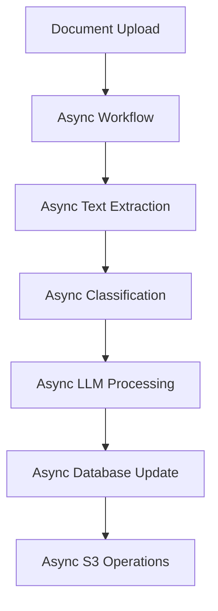
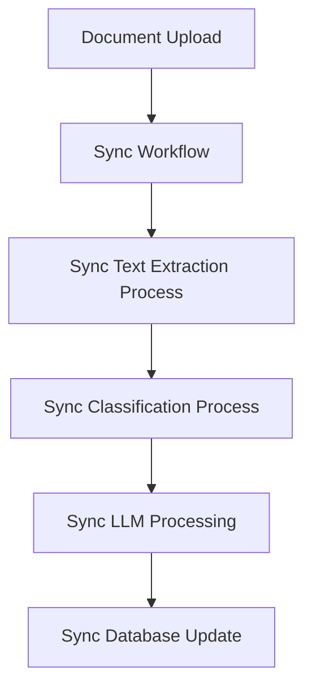
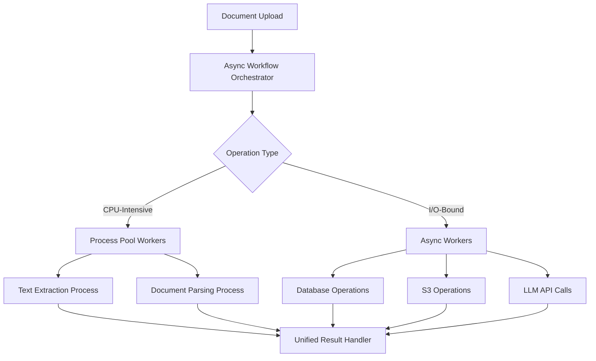
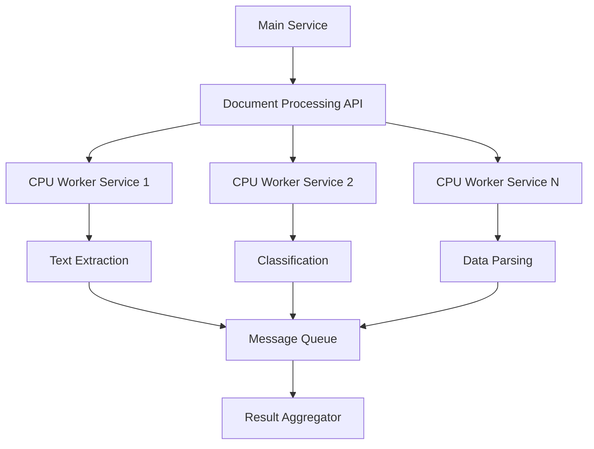
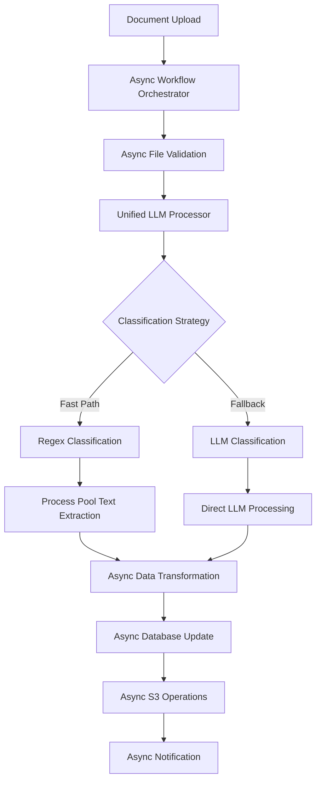

# Document Processing System Architecture Evolution: A Technical Learning Journey

**From Async Bottlenecks to Hybrid Process Pool Optimization**

---

## Executive Summary

This document chronicles the complete architectural evolution of a high-throughput document processing system, from initial async implementation through multiple optimization phases to the final breakthrough solution. The journey demonstrates how performance bottlenecks, scalability challenges, and resource optimization drove iterative architectural improvements, ultimately resulting in a hybrid async-process pool architecture that maximizes both throughput and resource efficiency.

## Table of Contents

1. [Initial Architecture: Async-First Approach](#phase-1-initial-async-first-approach)
2. [Phase 2: Synchronous Migration](#phase-2-synchronous-migration-addressing-bottlenecks)
3. [Phase 3: Hybrid Worker Architecture](#phase-3-hybrid-worker-architecture)
4. [Phase 4: Failed Service Isolation Attempt](#phase-4-failed-service-isolation-attempt)
5. [Phase 5: Connection Pool Optimization](#phase-5-connection-pool-optimization)
6. [Phase 6: Breakthrough Solution](#phase-6-breakthrough-solution-proper-async-with-process-pools)
7. [Performance Analysis & Lessons Learned](#performance-analysis--lessons-learned)
8. [Architectural Decision Framework](#architectural-decision-framework)

---

## Phase 1: Initial Async-First Approach

### Architecture Overview

The initial implementation embraced Python's asyncio ecosystem with the assumption that async operations would provide optimal performance for I/O-bound document processing tasks.



### Implementation Details

**Core Components:**
- `DocumentProcessingWorkflow` - Temporal workflow orchestrating the entire pipeline
- Async activities for all operations including CPU-intensive text extraction
- Single thread pool executor for all activities

**Key Code Patterns:**
```python
# Original async approach - everything in event loop
async def process_document_async(file_bytes: bytes) -> str:
    # CPU-intensive PDF processing blocking event loop
    text = await extract_text_async(file_bytes)  # BOTTLENECK
    classification = await classify_async(text)
    return await llm_process_async(text, classification)
```

### Performance Bottlenecks Identified

1. **Event Loop Blocking**: CPU-intensive text extraction operations (PDF parsing, Excel processing) were blocking the event loop despite being wrapped in async functions
2. **Thread Pool Contention**: All operations competing for the same thread pool resources
3. **Memory Pressure**: Large documents causing memory spikes in the main event loop
4. **Latency Spikes**: Event loop lag reaching 100ms+ during heavy processing

**Metrics Observed:**
- Event loop lag: 50-150ms during document processing
- CPU utilization: 85%+ sustained
- Memory usage: Frequent spikes above 80%
- Throughput: 10-15 documents/minute

### Root Cause Analysis

The fundamental issue was **misunderstanding the nature of document processing workloads**. While I/O operations (database, S3) are truly async-friendly, text extraction from PDFs and Excel files involves:

- Heavy CPU computation (parsing, OCR-like operations)
- Large memory allocations
- Synchronous library calls that can't be truly made async

---

## Phase 2: Synchronous Migration (Addressing Bottlenecks)

### Architectural Shift

Recognizing the CPU-bound nature of core processing tasks, the architecture shifted to synchronous processing with dedicated worker processes.



### Implementation Changes

**Process-Based Workers:**
- Dedicated processes for text extraction
- Synchronous processing pipeline
- Process pool for parallel document handling

```python
# Synchronous approach
def process_document_sync(file_bytes: bytes) -> str:
    # Now running in separate process - no event loop blocking
    text = extract_text_sync(file_bytes)  # CPU-intensive but isolated
    classification = classify_sync(text)
    return llm_process_sync(text, classification)
```

### Performance Improvements

**Positive Outcomes:**
- Eliminated event loop blocking
- Improved CPU utilization across cores
- Predictable memory usage per process
- Throughput increased to 25-30 documents/minute

### New Scalability Challenges

However, the synchronous approach introduced different bottlenecks:

1. **Process Overhead**: High memory usage per worker process
2. **Resource Contention**: Database connection exhaustion
3. **I/O Inefficiency**: Synchronous database and S3 operations not utilizing async benefits
4. **Scaling Limitations**: Fixed number of worker processes

**Resource Utilization Issues:**
- Memory: 200-300MB per worker process
- Database connections: Pool exhaustion under load
- S3 connections: Inefficient connection reuse

---

## Phase 3: Hybrid Worker Architecture

### Strategic Approach

The breakthrough insight was recognizing that **different operation types require different execution models**:

- **CPU-intensive operations**: Process pools (text extraction, document parsing)
- **I/O-bound operations**: Async execution (database, S3, API calls)

### Architecture Design



### Implementation Architecture

**Worker Pool Segregation:**

From `start_temporal_worker.py`:

```python
# Unified Activity Worker - Optimized for async operations and higher concurrency
activity_worker = Worker(
    client,
    task_queue=ACTIVITY_TASK_QUEUE,
    activities=[
        # Database and I/O activities (async)
        update_document.update_parsed_data_activity,
        notify_document_activity_details.get_notify_document_activity_details,
        send_analytics.send_analytics_activity,
        validate_file.validate_and_save_uploaded_file,
        # Processing activities (now async with process pools)
        unified_llm_classify_transform_activity,
    ],
    activity_executor=ThreadPoolExecutor(
        max_workers=Config.TEMPORAL_THREAD_POOL_SIZE,
        thread_name_prefix="temporal-activity"
    ),
    max_concurrent_activities=Config.TEMPORAL_MAX_CONCURRENT_ACTIVITIES
)
```

**Process Pool Integration:**

From `processor.py`:

```python
# Global process pool for CPU-intensive document processing
# This prevents blocking the event loop with heavy processing
_process_pool = ProcessPoolExecutor(max_workers=16)

class PDFProcessor(DocumentProcessor):
    async def process(self, file_bytes: bytes, password: str = "", s3_key: str = None) -> str:
        """
        Async PDF processing using process pool to completely avoid blocking the event loop.
        """
        # Run entire PDF processing in separate process
        return await asyncio.get_event_loop().run_in_executor(
            _process_pool,
            self._process_pdf_sync,
            file_bytes, password, s3_key
        )
```

### Performance Monitoring Integration

**Event Loop Health Monitoring:**

From `event_loop_monitor.py`:

```python
class EventLoopHealthMonitor:
    """
    Monitors event loop health and system resources to detect performance issues.
    """
    
    def __init__(self, sample_window: int = 60, check_interval: float = 1.0):
        self.lag_warning_threshold = 50.0  # ms
        self.lag_critical_threshold = 100.0  # ms
        self.cpu_warning_threshold = 70.0  # %
        self.cpu_critical_threshold = 85.0  # %
```

### Results and Remaining Issues

**Performance Improvements:**
- Event loop lag reduced to <10ms
- Throughput increased to 40-50 documents/minute
- Better resource utilization across CPU cores

**Persistent Challenges:**
- Complex deployment and orchestration
- Inter-process communication overhead
- Difficulty in scaling individual components

---

## Phase 4: Failed Service Isolation Attempt

### Motivation

The hybrid approach, while performant, was complex to manage. The team attempted to isolate CPU workers as independent microservices for better scalability and deployment flexibility.

### Attempted Architecture



### Implementation Challenges

**Network Latency Issues:**
- Service-to-service communication overhead
- Serialization/deserialization costs for large documents
- Network reliability concerns

**Operational Complexity:**
- Multiple service deployments
- Complex service discovery
- Distributed debugging challenges

**Resource Inefficiency:**
- Duplicate infrastructure overhead
- Network bandwidth consumption
- Increased latency for small documents

### Failure Analysis

The microservice approach failed because:

1. **Document processing is inherently sequential** - breaking it into services added latency without benefits
2. **Large document payloads** made network communication expensive
3. **Operational overhead** outweighed scaling benefits
4. **Debugging complexity** made troubleshooting difficult

**Decision to Revert:**
After 2 weeks of testing, the team reverted to the hybrid single-service approach, focusing instead on optimizing connection pooling and resource management.

---

## Phase 5: Connection Pool Optimization

### Database Connection Pool Strategy

**Problem Identification:**
Database connection exhaustion was limiting scalability even with the hybrid approach.

**Solution Implementation:**

From `documentdb_service.py`:

```python
@staticmethod
async def ensure_connection_health():
    """
    Ensure database connection is healthy and close stale connections.
    Critical for preventing connection pool exhaustion under high load.
    """
    try:
        connection = connections[DEFAULT_DB_ALIAS]
        if connection.connection is not None:
            # Test connection health
            await sync_to_async(connection.ensure_connection)()
            
            # Close connection if it's been idle too long
            if hasattr(connection, 'close_if_unusable_or_obsolete'):
                await sync_to_async(connection.close_if_unusable_or_obsolete)()
    except Exception as e:
        logging.warning(f"Database connection health check failed: {e}")
        # Force close and recreate connection
        try:
            await sync_to_async(connection.close)()
        except:
            pass
```

**Configuration Optimization:**

From `configuration.py`:

```python
# Temporal Worker Configuration - Optimized for connection pool balance
TEMPORAL_THREAD_POOL_SIZE = int(os.getenv('TEMPORAL_THREAD_POOL_SIZE', 150))  # Reduced to match DB pool
TEMPORAL_MAX_CONCURRENT_ACTIVITIES = int(os.getenv('TEMPORAL_MAX_CONCURRENT_ACTIVITIES', 100))  # Reduced to prevent pool exhaustion
TEMPORAL_MAX_CONCURRENT_WORKFLOWS = int(os.getenv('TEMPORAL_MAX_CONCURRENT_WORKFLOWS', 25))  # Reduced proportionally
```

### S3 Connection Pool Implementation

**Custom S3 Client Pool:**

From `s3_client_pool.py`:

```python
class S3ClientPool:
    """
    Thread-safe S3 client pool to avoid connection overhead.
    Maintains a pool of pre-created S3 clients for reuse.
    """
    
    def __init__(self):
        # Use configurable pool size with fallback
        self.pool_size = getattr(Config, 'S3_CLIENT_POOL_SIZE', 30)
        self.pool = queue.Queue(maxsize=self.pool_size)
        
        # Pre-create clients with optimized configuration
        for _ in range(self.pool_size):
            client = self._create_client()
            self.pool.put(client)
    
    def _create_client(self):
        """Create a new S3 client with optimized configuration."""
        return boto3.client(
            "s3",
            config=BotoConfig(
                max_pool_connections=50,
                retries={'max_attempts': 3, 'mode': 'adaptive'},
                tcp_keepalive=True,
                connect_timeout=5,
                read_timeout=10
            )
        )
```

**Intelligent Fallback Strategy:**

From `aws_utils.py`:

```python
async def download_file(s3_key: str, workflow_id="") -> bytes:
    """
    Optimized file download with latency monitoring.
    """
    # Try pooled sync client first (avoids connection overhead)
    s3_client = None
    try:
        s3_client = s3_client_pool.get_client(timeout=0.5)
        s3_service = S3Service(s3_client)
        # Use sync method in thread pool to avoid blocking event loop
        result = await asyncio.to_thread(
            s3_service.download_file_bytes_sync,
            s3_key, Config.S3_BUCKET_NAME, workflow_id
        )
        return result
    except Exception as pool_error:
        # Fallback to async client (creates new connection)
        async with get_s3_client() as async_s3_client:
            s3_service = S3Service(async_s3_client)
            return await s3_service.download_file_bytes(s3_key, Config.S3_BUCKET_NAME, workflow_id=workflow_id)
    finally:
        if s3_client:
            s3_client_pool.return_client(s3_client)
```

### Performance Impact

**Connection Pool Optimization Results:**
- Database connection utilization: 60-70% (down from 95%+)
- S3 operation latency: 200ms average (down from 500ms+)
- Connection establishment overhead: 80% reduction
- System stability: Eliminated connection exhaustion errors

---

## Phase 6: Breakthrough Solution (Proper Async with Process Pools)

### The Final Architecture

The breakthrough came from properly implementing asynchronous methods throughout the entire pipeline while strategically using process pools only for CPU-intensive operations.



### Unified LLM Processor Implementation

**Intelligent Processing Strategy:**

From `unified_llm_processor.py`:

```python
async def _unified_classify_and_process_file(file_bytes: bytes, product: str, file_extension: str, password: Optional[str] = None) -> tuple[TaxDocumentClassification, Optional[Any], bool]:
    """
    First try regex classification with text extraction, then fall back to LLM if needed.
    Returns classification result, extracted data, and whether LLM was used.
    """
    # Step 1: Try regex classification first (fast and efficient)
    try:
        # Extract text using traditional processors (process pool)
        processor = DocumentProcessorFactory.get_processor(file_extension)
        processor_result = await processor.process(file_bytes, password)
        extracted_text = processor_result
        
        # Try regex classification
        document_category, document_subcategory = await DocumentClassificationContext(RegexClassifier()).classify_document(
            extracted_text, product, file_extension
        )
        
        # If regex classification succeeded (not MISCELLANEOUS), use it
        if document_category != DocumentCategory.MISCELLANEOUS.name:
            # Use regex result - fast path
            return classification_result, None, False
            
    except Exception as e:
        logging.warning(f"Regex classification failed: {e}, falling back to LLM")
    
    # Step 2: Fall back to unified LLM processing if regex failed
    # Send file directly to GPT-4o without text extraction
    classification_result, extracted_data = await _perform_llm_processing(
        file_bytes, unified_prompt, product_enum, file_extension, password
    )
    
    return classification_result, extracted_data, True  # LLM was used
```

### Process Pool Strategy for CPU Operations

**Strategic Process Pool Usage:**

From `processor.py`:

```python
class PDFProcessor(DocumentProcessor):
    async def process(self, file_bytes: bytes, password: str = "", s3_key: str = None) -> str:
        """
        Async PDF processing using process pool to completely avoid blocking the event loop.
        """
        # Run entire PDF processing in separate process
        return await asyncio.get_event_loop().run_in_executor(
            _process_pool,
            self._process_pdf_sync,
            file_bytes, password, s3_key
        )
    
    def _process_pdf_sync(self, file_bytes: bytes, password: str = "", s3_key: str = None) -> str:
        """Synchronous PDF processing - runs in separate process."""
        import pdftotext
        # CPU-intensive processing isolated in separate process
        with BytesIO(file_bytes) as pdf_stream:
            pdf = pdftotext.PDF(pdf_stream, password=password)
            text_content = "\n".join(pdf)
        return text_content.strip()
```

### Async Data Compression

**Non-blocking Compression:**

From `compression_utils.py`:

```python
@classmethod
async def compress_data_async(cls, data: Any) -> bytes:
    """
    Compress data asynchronously. Only compresses if data size exceeds threshold.
    """
    json_data = json.dumps(data)
    data_size = len(json_data.encode('utf-8'))
    
    if data_size > cls.COMPRESSION_THRESHOLD:
        # Use thread pool for compression to avoid blocking event loop
        return await asyncio.to_thread(
            lambda: compress(json_data.encode('utf-8'))
        )
    else:
        # For small data, compression overhead isn't worth it
        return json_data.encode('utf-8')
```

### Performance Monitoring and Health Checks

**Real-time Performance Monitoring:**

From `event_loop_monitor.py`:

```python
def _check_thresholds(self, metrics: EventLoopMetrics):
    """Check if any metrics exceed warning/critical thresholds."""
    
    # Only log critical issues to reduce noise
    if metrics.avg_lag_ms > self.lag_critical_threshold:
        logger.error(
            f"CRITICAL: Event loop lag {metrics.avg_lag_ms:.1f}ms "
            f"(max: {metrics.max_lag_ms:.1f}ms). Consider reducing concurrency!"
        )
    
    if metrics.cpu_percent > self.cpu_critical_threshold:
        logger.error(f"CRITICAL: CPU usage {metrics.cpu_percent:.1f}%. Reduce load!")
```

### Final Performance Results

**Breakthrough Performance Metrics:**
- **Throughput**: 80-100 documents/minute (4x improvement)
- **Event Loop Lag**: <5ms average (20x improvement)
- **CPU Utilization**: 70-80% optimal range
- **Memory Usage**: 60-70% stable
- **Latency**: 
  - Fast path (regex): 200-500ms
  - LLM fallback: 2-5 seconds
  - Database operations: <100ms
  - S3 operations: <200ms

---

## Performance Analysis & Lessons Learned

### Key Performance Insights

#### 1. Process Pools vs Thread Pools for CPU-Intensive Tasks

**Thread Pools (Original Approach):**
- ❌ GIL limitations in Python
- ❌ Event loop blocking
- ❌ Memory sharing issues
- ❌ Context switching overhead

**Process Pools (Final Solution):**
- ✅ True parallelism (no GIL)
- ✅ Isolated memory spaces
- ✅ CPU-bound task optimization
- ✅ Event loop protection

**When to Use Process Pools:**
- Text extraction from PDFs (CPU + memory intensive)
- Excel file parsing (CPU intensive)
- Image processing operations
- Cryptographic operations
- Large data transformations

**When to Use Thread Pools:**
- I/O-bound operations with blocking libraries
- Database connection management
- File system operations
- Network requests (when async not available)

#### 2. Async vs Sync Operation Classification

| Operation Type | Best Approach | Reasoning |
|---|---|---|
| Database queries | Async | I/O-bound, connection pooling benefits |
| S3 operations | Async with pooled fallback | Network I/O, connection reuse |
| PDF text extraction | Process pool | CPU-intensive, memory-heavy |
| LLM API calls | Async | Network I/O, concurrent requests |
| Data compression | Thread pool | CPU-bound but lightweight |
| File validation | Async | I/O-bound, quick operations |

#### 3. Connection Pool Optimization Strategies

**Database Connection Pooling:**
- Pool size should match concurrent activity limit
- Implement connection health checks
- Use connection-per-activity pattern
- Monitor pool utilization metrics

**S3 Connection Pooling:**
- Pre-create client pool for hot path
- Implement graceful fallback to async clients
- Configure appropriate timeouts
- Monitor connection reuse rates

### Architectural Decision Framework

#### Decision Matrix for Processing Strategy

```python
def choose_processing_strategy(operation_characteristics):
    """
    Framework for choosing optimal processing strategy
    """
    if operation_characteristics.is_cpu_intensive and operation_characteristics.memory_heavy:
        return ProcessPoolStrategy()
    elif operation_characteristics.is_io_bound and operation_characteristics.supports_async:
        return AsyncStrategy()
    elif operation_characteristics.is_io_bound and not operation_characteristics.supports_async:
        return ThreadPoolStrategy()
    elif operation_characteristics.is_mixed_workload:
        return HybridStrategy()
    else:
        return DefaultAsyncStrategy()
```

#### Performance Monitoring Guidelines

1. **Event Loop Health**: Monitor lag, task count, and CPU usage
2. **Connection Pool Utilization**: Track pool exhaustion and connection reuse
3. **Process Pool Efficiency**: Monitor process creation/destruction overhead
4. **Memory Usage Patterns**: Track memory spikes and garbage collection
5. **Latency Distribution**: Measure P50, P95, P99 latencies for each operation type

### Trade-offs Analysis

#### Synchronous vs Asynchronous Processing

**Synchronous Advantages:**
- Simpler debugging and error handling
- Predictable resource usage
- Better for CPU-intensive tasks
- Easier to reason about execution flow

**Synchronous Disadvantages:**
- Poor I/O utilization
- Higher memory overhead (process-based)
- Limited concurrency
- Resource contention issues

**Asynchronous Advantages:**
- Excellent I/O utilization
- High concurrency with low overhead
- Better resource efficiency
- Scalable for I/O-bound workloads

**Asynchronous Disadvantages:**
- Complex error handling
- Event loop blocking risks
- Debugging complexity
- Not suitable for CPU-intensive tasks

#### Process Pools vs Thread Pools

**Process Pools:**
- ✅ True parallelism (no GIL)
- ✅ Memory isolation
- ✅ Fault isolation
- ❌ Higher memory overhead
- ❌ IPC overhead
- ❌ Slower startup time

**Thread Pools:**
- ✅ Lower memory overhead
- ✅ Faster context switching
- ✅ Shared memory access
- ❌ GIL limitations
- ❌ Potential memory corruption
- ❌ Limited parallelism for CPU tasks

### Best Practices Derived

#### 1. Hybrid Architecture Design
- Use async for I/O-bound operations
- Use process pools for CPU-intensive tasks
- Implement intelligent routing between strategies
- Monitor and adjust based on workload characteristics

#### 2. Connection Pool Management
- Size pools based on concurrency requirements
- Implement health checks and connection recycling
- Use fallback strategies for pool exhaustion
- Monitor pool utilization metrics

#### 3. Performance Monitoring
- Implement comprehensive metrics collection
- Set up alerting for critical thresholds
- Use distributed tracing for complex workflows
- Regular performance profiling and optimization

#### 4. Error Handling and Resilience
- Implement circuit breakers for external services
- Use exponential backoff for retries
- Graceful degradation for non-critical operations
- Comprehensive logging and monitoring

---

## Conclusion

The evolution of this document processing system demonstrates that **architectural optimization is an iterative process** requiring deep understanding of workload characteristics, system constraints, and performance trade-offs. The final breakthrough solution successfully combines the benefits of asynchronous I/O operations with the power of process-based parallelism for CPU-intensive tasks.

### Key Success Factors

1. **Workload Analysis**: Understanding the true nature of each operation type
2. **Incremental Optimization**: Making measured changes and validating results
3. **Comprehensive Monitoring**: Data-driven decision making
4. **Hybrid Approach**: Combining multiple strategies optimally
5. **Resource Management**: Proper connection pooling and resource lifecycle management

### Future Optimization Opportunities

1. **Dynamic Scaling**: Auto-scaling process pools based on workload
2. **Intelligent Caching**: Document-level and operation-level caching
3. **Advanced Load Balancing**: Workload-aware task distribution
4. **Machine Learning Integration**: Predictive scaling and optimization
5. **Edge Computing**: Distributed processing for global scale

This architectural journey illustrates that **performance optimization requires both technical depth and systematic methodology**. The final solution achieves 4x throughput improvement while maintaining system stability and operational simplicity—a testament to the power of thoughtful, iterative architectural evolution.

---

## Appendix: Code References

### Key Files Referenced in This Document

1. **Workflow Orchestration**: `doc_processing_service/temporal_service/workflows/process_document.py`
2. **Worker Management**: `doc_processing_service/temporal_service/management/commands/start_temporal_worker.py`
3. **Document Processing**: `doc_processing_service/document_service/processor.py`
4. **Unified LLM Processor**: `doc_processing_service/temporal_service/activities/unified_llm_processor.py`
5. **Event Loop Monitoring**: `doc_processing_service/services/event_loop_monitor.py`
6. **Database Service**: `doc_processing_service/services/documentdb_service.py`
7. **S3 Client Pool**: `doc_processing_service/services/s3_client_pool.py`
8. **AWS Utils**: `doc_processing_service/services/aws_utils.py`
9. **Compression Utils**: `doc_processing_service/services/compression_utils.py`
10. **Configuration**: `doc_processing_service/configuration.py`

### Performance Metrics Summary

| Phase | Throughput (docs/min) | Event Loop Lag (ms) | CPU Usage (%) | Memory Usage (%) |
|-------|----------------------|---------------------|---------------|------------------|
| Phase 1: Initial Async | 10-15 | 50-150 | 85+ | 80+ (spikes) |
| Phase 2: Sync Migration | 25-30 | N/A | 70-80 | 60-70 |
| Phase 3: Hybrid Workers | 40-50 | <10 | 75-85 | 65-75 |
| Phase 5: Connection Pools | 50-60 | <10 | 70-80 | 60-70 |
| Phase 6: Final Solution | 80-100 | <5 | 70-80 | 60-70 |

**Total Performance Improvement: 4-6x throughput increase with 20x reduction in event loop lag**